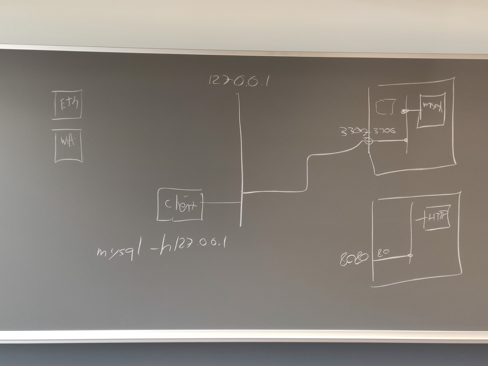
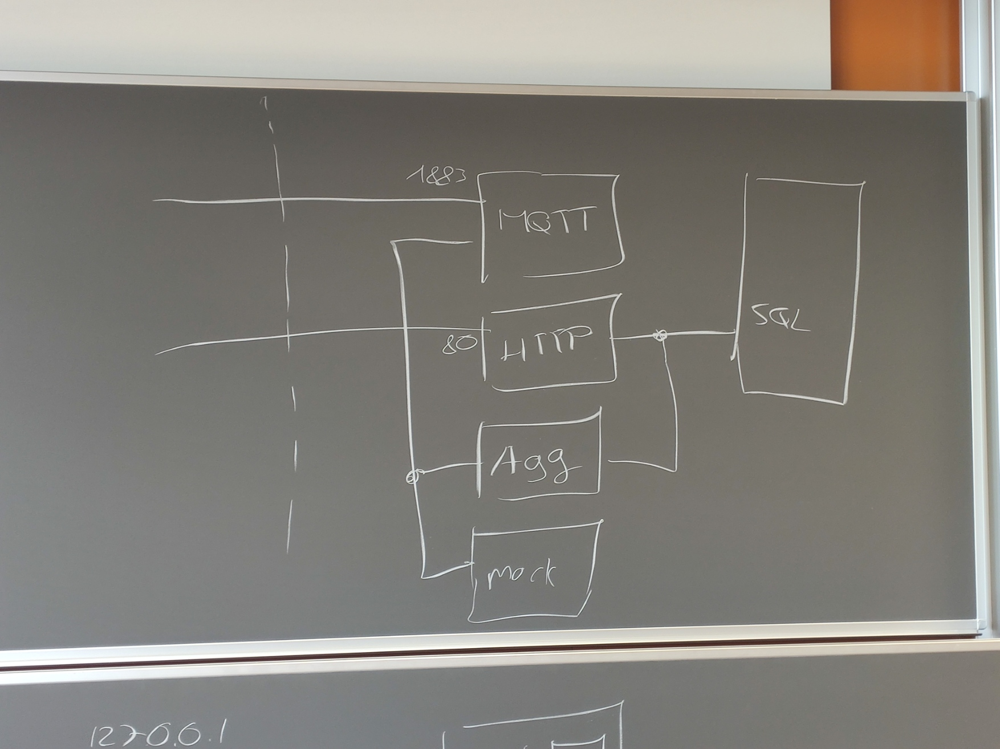

# Week 11

# Labo 02

## Explications générales

L'image ci-dessous représente le système réseau d'un ordinateur. On remarque sur la droite les ports physique de l'ordinateur. La ligne verticale avec `127.0.0.1` correspond a un "switch" interne à l'ordinateur et en réalité c'est le `localhost`. Les autres carrés correspondent à des containers docker qui sont complétements isolés. On remaque qu'il est nécessaire de les connecter sur le `localhost` pour pouvoir les utiliser. On va donc utiliser le port `3306` pour la base de données dans le container et pour le `localhost`. Le chiffre `3306` n'est pas un chiffre aléatoire, c'est le port par défaut de MySQL. Pour un serveur web, on utilisera le port `80` à l'intérieur du container, mais comme il est probablement déjà utilisé sur le `localhost`, on utilisera un autre port, par exemple `8080`.

Ci-dessous un schéma de tous les composants présents dans le labo. On remaque qu'il y aura un réseau commun au `SQL`, `HTTP` et `Aggregator`. Ensuite un autre réseau commun au `Aggregator`, `MQTT` et `MOCK`. Seul le `MQTT`et `HTTP` seront connectés au `localhost` afin d'être plus sécurisé.

## Commandes `docker`

- `docker-compose up` : démarre les containers même s'ils n'existent pas encore
- `docker-compose up -d` : démarre les containers en arrière plan
- `docker-compose start` : démarre les containers existants
- `docker-compose stop` : arrête les containers existants
- `docker-compose down` : arrête les containers et les supprime
- `docker-compose build <container-name>` : reconstruit un container

## Recontruire un container

- `docker-compose build <container-name>` : reconstruit un container
- `docker-compose up -d` : démarre les containers en arrière plan

## Accéder à un container

- `docker exec -it <container-name> bash` : accède au container en mode interactif avec un terminal bash

comme bash n'est pas POSIX, il faut utiliser `sh` à la place quand c'est un containe avec une configuration minimaliste.

- `docker exec -it <container-name> sh` : accède au container en mode interactif avec un terminal sh

